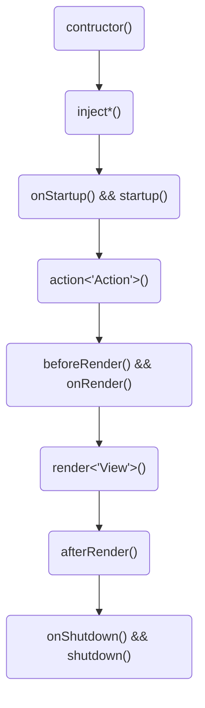

# **Allo Controllers** for Deno 🦕

Simple "convention over configuration" Controllers solution for Deno.

Extends the [**Allo Routing**](https://deno.land/x/allo_routing/mod.ts) framework with a **Controllers** layer.

# Controller

```ts
// ./controllers/HomepageController.ts
import { Controller } from "../../libs/Controller.ts";

export class HomepageController extends Controller {
    renderDefault() {
        this.sendText("Hello World!");
    }
}
```


```ts
// ./main.ts
import { Server } from "https://deno.land/x/allo_server/mod.ts";
import { ControllerManager, RouterList } from "https://deno.land/x/allo_controllers/mod.ts";

const manager = new ControllerManager("./controllers");

const router = new RouterList(manager);
router.addController("homepage/<action>", "Homepage:default");

const server = new Server(router);
server.listen({ port: 8080 });
```

## Life Cycle



---


## Documentation 📖

Description of all classes and methods with **examples**
will found in the [documentation](https://doc.deno.land/https://deno.land/x/allo_controllers/mod.ts).


---

Check out other [ours packages 📦](https://deno.land/x?query=allo_)!